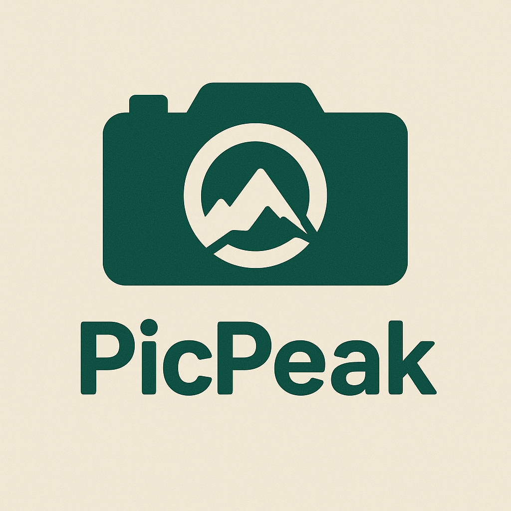
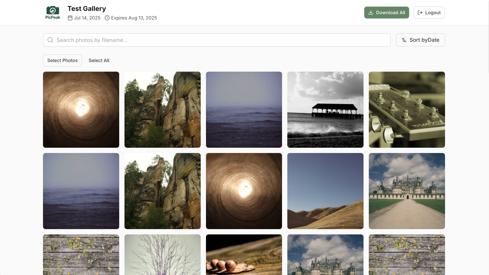
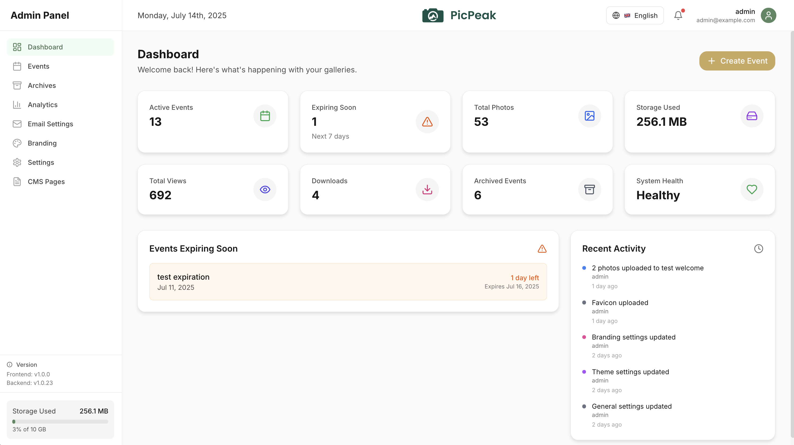
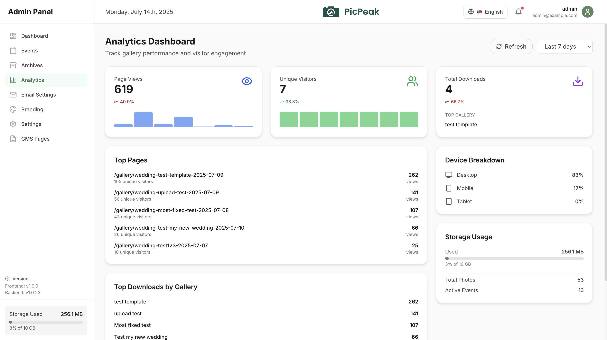
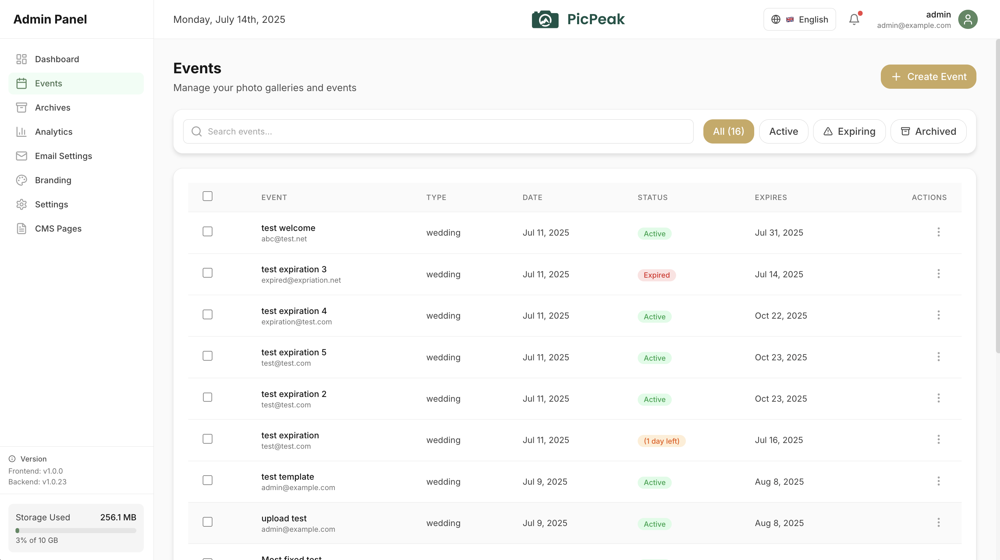

<div align="center">
  

  # 📸 PicPeak

  **Open-source, self-hosted photo sharing for events.**

  [](https://opensource.org/licenses/MIT)
  [](https://www.docker.com/)
  [](https://buymeacoffee.com/theluap)

  [Homepage](https://www.picpeak.app) · [Live Demo](https://demo.picpeak.app) · [Documentation](https://docs.picpeak.app) · [Support ☕](https://buymeacoffee.com/theluap)
</div>

---

**PicPeak** is a powerful, self-hosted open-source alternative to commercial photo-sharing platforms like PicDrop.com and Scrapbook.de. Built for photographers and event organizers, it makes it simple to share beautiful, time-limited photo galleries with clients while keeping full control over your data and branding.



> [!IMPORTANT]
> **PicPeak has moved to its own GitHub organization.** Docker images are now at `ghcr.io/picpeak/picpeak/{backend,frontend,aio,ml}` (and on Docker Hub as `picpeak/{backend,frontend,aio,ml}`) and active development is on `main`. The old `ghcr.io/the-luap/...` path still responds but its tags are **frozen** at 2026-05-27 — if updates never arrive, check your image path first. See **[`docs/migration-to-org.md`](docs/migration-to-org.md)** for the one-line `docker-compose.yml` edit.

## Contents

- [Live Demo](#-live-demo)
- [Quick Start](#-quick-start)
- [Why PicPeak?](#-why-picpeak)
- [Features](#-features)
- [Documentation](#-documentation)
- [Comparison](#-comparison-with-alternatives)
- [Tech Stack](#️-tech-stack)
- [Contributing & Support](#-contributing)
- [License](#-license)

## 🎮 Live Demo

Try PicPeak without installing anything — [demo.picpeak.app](https://demo.picpeak.app) · [admin panel](https://demo.picpeak.app/admin)

| Email | Password |
|---|---|
| `demo@picpeak.app` | `Demo2026!` |

> The demo resets periodically. Uploaded content may be removed without notice.

## 🚀 Quick Start

Get PicPeak running in under 5 minutes:

```bash
# Clone the repository
git clone https://github.com/PicPeak/picpeak.git
cd picpeak

# Copy the environment template — the defaults work out of the box.
# Machine secrets (JWT, DB, Redis) are auto-generated on first run, and the
# admin account is created in the browser. Edit .env only to customise
# (domain, SMTP, storage paths, …) — nothing is required.
cp .env.example .env

# Start with Docker Compose
docker compose up -d

# Access at http://localhost:3000
```

On first start, open **http://localhost:3000/admin** and follow the in-browser setup to create your admin account. Full details — the one-time setup token, Docker file permissions, and ARM64 notes — are in **[First-run setup](https://docs.picpeak.app/getting-started/first-login)**.

The frontend port is published on every host interface by default; the raw
backend port binds to host loopback (`PICPEAK_BACKEND_BIND_ADDRESS` overrides
it). For public access, terminate TLS in a reverse proxy on the host and set
`PICPEAK_BIND_ADDRESS=127.0.0.1` so the plain-HTTP port cannot be reached
around it.

Compose trusts one forwarding hop (its frontend nginx). For a host-local TLS
proxy in front of the frontend, set `TRUST_PROXY=2`, `COOKIE_SECURE=true` and
`ENABLE_HSTS=true`. Keep the frontend loopback-only with this two-hop setting,
and configure the outer proxy to append or overwrite forwarding headers using
the real client address. The installer selects these settings in proxy mode.

> **Updating / release channels:** set `PICPEAK_CHANNEL` (`stable` default, or `beta`) in `.env`, then `docker compose pull && docker compose up -d`. To update from the admin UI instead, enable [in-app updates](docs/self-update.md). See [RELEASING.md](RELEASING.md) for the promotion cadence.

> [!NOTE]
> **Recommended hardening:** an existing install keeps working without
> changes. With `TRUST_PROXY` unset PicPeak still trusts forwarding headers
> from every private-range address (and logs a warning at startup); set it to
> the exact number of reverse-proxy hops instead. Behind TLS, also set
> `COOKIE_SECURE=true`, and bind the origin to loopback
> (`PICPEAK_BIND_ADDRESS=127.0.0.1` for Compose, `LISTEN_HOST=127.0.0.1` for a
> native install). The Compose files now publish the raw backend port on host
> loopback only and pass `TRUST_PROXY` through unchanged (the installer writes an exact hop count for new installs). Unattended installer runs require
> `--allow-insecure-http` before creating a plaintext deployment.

### Or: one container, no compose file

For a home server, a NAS, or a single small studio, the all-in-one image runs the whole app as one process with SQLite — no compose file, no separate database, no reverse proxy to wire up:

```bash
docker run -d --name picpeak -p 127.0.0.1:3000:3000 \
  -e COOKIE_SECURE=auto \
  -v picpeak:/data \
  ghcr.io/picpeak/picpeak/aio:main
```

The cookie mode above (also the default) suits this loopback-only HTTP quick
start. A TLS deployment should set `COOKIE_SECURE=true` and enable HSTS. The
JWT secret is generated on first start and kept on the volume.

Then open **http://localhost:3000/admin** and read the setup token with `docker exec picpeak cat /data/db/SETUP_TOKEN`, or open `db/SETUP_TOKEN` on the volume with any file manager if the host has no shell.

`:main` is the active-development tag, and today it is the only one the all-in-one image has — `Dockerfile.aio` landed after the current stable release, so `:stable` and `:latest` first appear for this image once the aio build reaches the `stable` branch. Switch to `:stable` then, or pin a published version tag if you would rather not track `main`.

The compose stack above is still the right choice for anything busier — SQLite takes one writer at a time, and Postgres is what scales. You can move to it later without reinstalling: take a `.picpeak` backup and restore it into the full stack. See **[Single-container install](https://docs.picpeak.app/deployment/single-container)** for the volume layout, the external-Postgres variant, TLS, and the limits.

### Docker images

| | GHCR | Docker Hub |
|---|---|---|
| Backend | `ghcr.io/picpeak/picpeak/backend` | [`picpeak/backend`](https://hub.docker.com/r/picpeak/backend) |
| Frontend | `ghcr.io/picpeak/picpeak/frontend` | [`picpeak/frontend`](https://hub.docker.com/r/picpeak/frontend) |
| All-in-one | `ghcr.io/picpeak/picpeak/aio` | [`picpeak/aio`](https://hub.docker.com/r/picpeak/aio) |
| ML sidecar (optional) | `ghcr.io/picpeak/picpeak/ml` | [`picpeak/ml`](https://hub.docker.com/r/picpeak/ml) |

Both registries get the same digests and the same tags — `stable`/`latest`, a pinned `x.y.z`, and `beta`/`main` for the active development channel — for `linux/amd64` and `linux/arm64`. Keep every image in one install on the **same** tag.

### Rsync/SSH backup destination security

Rsync connection tests and backup runs resolve and vet every DNS answer, then pin SSH to approved public addresses. Private, metadata, reserved and mixed public/private destinations are refused. For multi-address destinations, an application-owned TCP relay can try the next captured literal only before connecting; it never resolves DNS again or retries an established SSH/rsync operation. SSH host-key verification remains bound to the configured hostname, including when its approved address changes. No private-network bypass is provided.

Before use, obtain the destination's SSH host public key and fingerprint through an independent trusted channel with its operator. Provision a `known_hosts` entry for that hostname; do not trust unverified `ssh-keyscan` output or delete a changed-key entry merely to make a test pass. Existing verified entries remain usable. Unknown or changed keys fail instead of being learned automatically.

Pass `BACKUP_SSH_KNOWN_HOSTS` into the backend/AIO process to select an absolute readable trust-file path (without spaces or shell syntax). Otherwise a configured private key uses `known_hosts` in its directory. These selected files may be read-only and are the only host-key trust source. With neither selected, pre-provisioned OpenSSH default user/global trust remains available; default identity files and an SSH agent still work when no key is configured. Mount trust and key files persistently and independently of backup contents. The SSH connection ignores local/system configuration, aliases, proxies and control sockets, connects to the SSH port from the backup settings (22 by default), and does not accept ports or jump hosts from SSH configuration. For a port other than 22 the `known_hosts` entry is named `[host]:port`, as `ssh-keyscan -p` writes it; the host part is always the lower-case name without a trailing dot. When the selected trust file is missing, the backend logs the expected path at startup. Verify intentional server key replacements independently before updating the approved entry.

## 🌟 Why PicPeak?

Unlike expensive SaaS solutions, PicPeak gives you:

- **💰 No Monthly Fees** — one-time setup, unlimited galleries
- **🔒 Complete Data Control** — your photos stay on your server
- **🎨 White-Label Ready** — full branding customization
- **📱 Mobile-First Design** — beautiful on all devices
- **🌍 Multi-Language** — built-in i18n (EN, DE)

## ✨ Features

**For photographers** — drag & drop upload, auto-expiring & password-protected galleries, automated emails, an analytics dashboard, custom themes, a public landing page, and a [Live Slideshow](https://docs.picpeak.app/features/live-slideshow) projector view that auto-picks-up new uploads during live events.

**For clients** — clean mobile-optimized galleries, one-click bulk downloads, smart search, **[People in this gallery](https://docs.picpeak.app/features/face-recognition)** face grouping (opt-in per gallery, needs the optional [ML sidecar](https://github.com/PicPeak/picpeak/blob/main/ml/README.md)), optional guest uploads, and download protection (watermarking + right-click prevention).

**Technical** — Docker-ready, automatic thumbnail generation, external media reference mode, smart archiving of expired galleries, S3-compatible [storage backends](https://docs.picpeak.app/features/storage-backends), [webhooks](https://docs.picpeak.app/features/webhooks), and security-first defaults (JWT, rate limiting, CORS).

<details>
<summary><strong>🧾 For studios — CRM &amp; Accounting (Beta, off by default)</strong></summary>

- 📝 **Quotes → Contracts → Invoices** — one deal lineage; cancel-and-reissue (Storno) keeps issued invoices immutable
- ⏱️ **Hours Logging & Calendar** — per-customer time tracking; admin calendar of events, logged hours, and pending quotes/contracts
- 🧾 **Inbound Supplier Invoices & Expenses** — capture received invoices (upload/camera, rasterised server-side), categorise, and re-bill costs to clients
- 📊 **Tax Report & Accountant Export** — period-scoped income/cost report with VAT breakdown; PDF/CSV plus a Treuhänder/Banana (Swiss/LI) journal export
- 🌍 **VAT & Multi-currency** — single VAT-code registry snapshotted onto each document

</details>

> [!WARNING]
> **CRM & Accounting — examples only, verify locally.** Feature-flagged off by default. Seeded contract blocks are written by the maintainer, **not a lawyer**; QR-bills/SEPA payloads and every tax, VAT and Treuhänder/Banana figure are computed from your input and defaults and are **jurisdiction-specific guidance only**. Have your lawyer review contracts, scan a test QR with your bank's app, and verify all numbers with your accountant / Treuhänder / tax authority before customer-facing use. Read **[the CRM disclaimers](https://docs.picpeak.app/features/crm/disclaimers)** first.

## 📖 Documentation

### Standard backup authenticity and recovery

Standard JSON/YAML backups use a v3 canonical HMAC-SHA256 manifest. The signature
binds the full restore description, algorithm and key ID, including dump/file
digests and stored-path metadata. Normal restores refuse missing keys, unsigned
manifests, algorithm downgrades and unsafe legacy checksum serialization; `force`
and the install trigger do not bypass this boundary. This is separate from the
portable `.picpeak` format.

Retain the **dedicated signing key separately and off-host** before relying on a
backup. Compose provisions `backup_manifest_key` in the private backend secrets
volume, not the Postgres/Redis volumes. Native/AIO creates
`DATA_DIR/backup-manifest.key` (native default: `backend/data`) on first signing,
outside backed-up storage. An explicit `BACKUP_MANIFEST_KEY` must be 64 hex digits
from a random 32-byte value (`openssl rand -hex 32`); an explicit
`BACKUP_MANIFEST_KEY_FILE` must be outside the managed/legacy storage estate.
Verification never generates a replacement for a lost key. Restore the original
key on a fresh recovery host, not a key supplied by the backup being verified.
System Health reports key readiness and latest manifest authenticity separately
from completion. A missing/invalid key or unverified manifest is not healthy.
An invalid key (wrong encoding, group/world-writable or symlinked key file) does
not stop the server: it is logged at boot, shown in System Health, and backups
fail until it is corrected. A latest manifest that only predates authentication
is reported as legacy rather than unhealthy; the next backup signs a new one.

Retain previous v3 keys with `BACKUP_MANIFEST_KEYS_OLD` (comma-separated 64-hex
values) while rotating. Only canonical pre-v3 HMAC manifests can use the explicit
`BACKUP_MANIFEST_LEGACY_KEY` compatibility setting (the original key string, of
any length); an earlier passphrase-style `BACKUP_MANIFEST_KEY` left in place
verifies those manifests the same way but never signs a new one. The old
under-covering serializer is never accepted as authenticated. Preserve all keys needed by retained backups. Installer
reconfiguration keeps signing/key-ring settings but clears one-artifact recovery
approval; key files survive updates independently of application source.

If an old backup is unsigned, uses the unsafe legacy serializer, or its original
key was lost, it is **unauthenticated**. Recover only on an isolated host after
independently inspecting/trusting its contents (database dumps may contain SQL
and client commands). Run the read-only helper:

```sh
cd backend
node scripts/backup-manifest-recovery-digest.js /trusted/staged/manifest.json
```

Set `BACKUP_MANIFEST_RECOVERY_SHA256` to that complete artifact digest and
`BACKUP_MANIFEST_RECOVERY_REASON` to a meaningful operator reason in trusted host
configuration, restart the recovery process and restore that one manifest.
The exception does not prove authenticity; inspection/health still reject it.
Restores prominently log and retain the unauthenticated outcome and reason.
Different artifact contents cannot reuse the approval. Missing content digests
are allowed only in this explicitly approved flow; recorded digests must still
match. **Remove both recovery variables immediately afterward**, restart, retain
the audit and create a new authenticated backup with a separately retained key.

Full documentation lives at **[docs.picpeak.app](https://docs.picpeak.app)** — deployment, admin settings, API, branding, and more.

| Topic | Link |
|---|---|
| 🚀 Deployment (Docker, env, reverse proxy, SSL) | [docs.picpeak.app/deployment](https://docs.picpeak.app/deployment) |
| 📦 Single-container install (one `docker run`, SQLite) | [docs.picpeak.app/deployment/single-container](https://docs.picpeak.app/deployment/single-container) |
| ⚙️ Admin settings reference | [docs.picpeak.app/guides/admin-settings](https://docs.picpeak.app/guides/admin-settings) |
| 🎯 Creating events | [docs.picpeak.app/guides/creating-events](https://docs.picpeak.app/guides/creating-events) |
| 📽️ Live Slideshow | [docs.picpeak.app/features/live-slideshow](https://docs.picpeak.app/features/live-slideshow) |
| 🙂 People in galleries (face grouping) | [docs.picpeak.app/features/face-recognition](https://docs.picpeak.app/features/face-recognition) |
| 💾 Backup & Restore | [docs.picpeak.app/guides/backup-restore](https://docs.picpeak.app/guides/backup-restore) |
| 🔌 API reference | [docs.picpeak.app/api](https://docs.picpeak.app/api) |
| 🪝 Webhooks | [docs.picpeak.app/features/webhooks](https://docs.picpeak.app/features/webhooks) |
| 💾 Storage backends (local / S3) | [docs.picpeak.app/features/storage-backends](https://docs.picpeak.app/features/storage-backends) |
| 💻 System requirements & tuning | [docs.picpeak.app/deployment/system-requirements](https://docs.picpeak.app/deployment/system-requirements) |
| 🧾 CRM & Accounting | [docs.picpeak.app/features/crm](https://docs.picpeak.app/features/crm) · [disclaimers](https://docs.picpeak.app/features/crm/disclaimers) |
| 🗺️ Roadmap | [GitHub Issues](https://github.com/PicPeak/picpeak/issues) |

**Project meta:** [Support](SUPPORT.md) · [Contributing](CONTRIBUTING.md) · [License](LICENSE) · [Security](SECURITY.md) · [Code of Conduct](CODE_OF_CONDUCT.md)

### S3-primary backup and recovery

`STORAGE_BACKEND=s3` selects the live media store (`STORAGE_S3_*`); the backup destination (`backup_s3_*`, local, or rsync) is independent. Standard backups and photo-inclusive `.picpeak` exports capture managed originals, archives, derived media, customer documents and both transfer attachment roots from the live adapter, preserving object headers and custom metadata. CRM PDFs/signatures and static uploads remain local and are included alongside those objects. Administrator path toggles/exclusions and document-only or row-only portable exports remain intentional selection policies.

Capturing S3-primary backups uses a private temporary tree: provide temporary disk capacity for the entire selected file estate, not just one object. Missing required objects, interrupted capture or publication, and reference changes during a database dump fail the run rather than produce a completed incomplete backup. Scheduled database dumps record their storage references; after upgrading, create a new database dump before reusing a pre-upgrade dump with inline dumping disabled.

Before restoring on a fresh host, configure the target `STORAGE_BACKEND` and `STORAGE_S3_*` credentials/bucket/prefix. Recovery uses deployment-relative keys, not the source bucket namespace, and verifies actual target objects rather than unused local copies. Standard recovery's default safety backup preserves prior S3 bytes/metadata and removes newly created keys on rollback. Legacy format-1 portable archives remain readable; transfer attachments always retain download-only delivery headers. Portable import database/files atomicity is a separate limitation.

### Mail network policy

Every SMTP/IMAP connection validates and consumes only its current vetted DNS
answers, while retaining the configured hostname for TLS verification. Private
mail servers require deployment-owned `MAIL_PRIVATE_ENDPOINTS` entries with an
exact protocol, hostname and explicit port, for example `smtp://mailhog:1025` or
`imap://mail.internal:993`. No settings request can add an approval. The
`SMTP_HOST`/`SMTP_PORT` pair in the deployment environment counts as approved
for exactly that host and port, so a relay the deployment itself names keeps
sending after an upgrade; a host or port changed in the admin UI does not.
Approved endpoints may resolve to private, loopback or carrier-grade NAT
addresses. Metadata, link-local, multicast and reserved addresses remain
forbidden even with an approval. For the Compose `dev` mail catcher, set
`SMTP_HOST=mailhog` and `SMTP_PORT=1025`.
An approval does not disable TLS certificate checks; production private TLS
servers still need a trusted certificate for their configured hostname.

## 📊 Comparison with Alternatives

| Feature | PicPeak | PicDrop | Scrapbook.de | Pixieset |
|---------|---------|---------|--------------|----------|
| Self-Hosted | ✅ | ❌ | ❌ | ❌ |
| Custom Branding | ✅ Full | Limited | Limited | ✅ (paid) |
| Monthly Cost | $0* | $29-199 | €19-99 | ~$60 |
| Storage Limit | Unlimited** | 50-500GB | 100-1000GB | 3GB–Unlimited*** |
| Client Uploads | ✅ | ✅ | ✅ | Limited |
| API Access | ✅ | Paid | ❌ | ❌ |
| Open Source | ✅ | ❌ | ❌ | ❌ |
| Customer Accounts | ✅ | ❌ | ❌ | ✅ |
| Quotes / Contracts / Invoices | 🧪 Beta | ❌ | ❌ | ✅ |
| Incoming Invoices & Accounting | 🧪 Beta | ❌ | ❌ | ❌ |

<sub>*You bring your own server and, optionally, a domain. **Limited only by your server storage. ***Pixieset's "unlimited" is photos only; video is capped by plan. 🧪 Beta = built but feature-flagged off by default.</sub>

## 🏗️ Tech Stack

- **Backend**: Node.js, Express, SQLite/PostgreSQL
- **Frontend**: React, Tailwind CSS, Framer Motion
- **Storage**: Local filesystem (default) or S3-compatible object store (AWS S3, MinIO, R2, B2, Wasabi, Spaces) — see [Storage Backends](https://docs.picpeak.app/features/storage-backends)
- **Email**: SMTP with customizable templates
- **Analytics**: Privacy-focused with Umami integration
- **External media**: point PicPeak at `EXTERNAL_MEDIA_ROOT` to reference existing originals read-only, index quickly, and generate thumbnails on demand

Official images use Sharp's bundled native libraries. Custom installations using
a globally installed libvips must also provide librsvg 2.63.2 or newer for safe
SVG decoding; updating the npm package does not update system libraries.

## 📸 Screenshots

<details>
<summary>Click to see the admin dashboard, analytics, and event management</summary>

### 🎛️ Admin Dashboard


### 📊 Analytics & Insights


### 📁 Event Management


</details>

## 🤝 Contributing

We love contributions! PicPeak is built by photographers, for photographers — whether you're fixing bugs, adding features, or improving docs. See the [Contributing Guide](CONTRIBUTING.md) to get started.

Found a security issue? Please open a [security issue](https://github.com/PicPeak/picpeak/issues/new?labels=security). See [SECURITY.md](SECURITY.md) for the policy.

## Standalone backup restore points

New local and S3 scheduled/manual file backups copy every eligible file into
a unique restore-point directory or object prefix. Their manifests are full
catalogues marked `standalone-v1`, with no parent dependency; an included,
verified database dump lives inside the same point. Existing path, feature,
filename and maximum-file-size exclusions still apply. These backups do not
cover storage outside the configured backup scope.

Local/S3 `backup_incremental` settings no longer skip unchanged files. Plan
capacity for a full copy per retained point and temporary space for one S3
upload file. After each successful run the newest `backup_retention_count`
points of the current destination are kept (default 7, `0` keeps all) and
older ones are removed whole with their history entries; deleting a
standalone run from the history removes its point too. Legacy backup trees
are never pruned. An earlier point is not overwritten by a later run, a run
that fails removes its partial copy, and deleting separately retained
database dumps does not invalidate a standalone point.

Select the point's manifest in the restore wizard. A rescued local mount must
be under a configured backup location (or `RESTORE_ALLOWED_ROOTS`); its
default nested `manifests/` layout can move or be renamed without rewriting
the manifest. A downloaded ZIP's root `manifest.json` also identifies its
extracted directory as the selected point.
S3 recovery uses the selected manifest's bucket/prefix and current credentials.
Keep custom manifests together with their recorded snapshot location.

An empty `RESTORE_ON_INSTALL` trigger still auto-selects the newest local
manifest, searching both the shared `manifests/` directory and immediate
`backup-UUID/manifests/` points. For a renamed point or custom manifest location,
put its explicit manifest path in the trigger file instead.
Here, newest means the manifest file's modification time across both layouts,
not its filename or an unverified timestamp inside it. Automatic discovery does
not follow symlinked point/manifests directories. To recover an older point or
avoid changed timestamps after copying a rescue mount, name the exact manifest
in the trigger instead of leaving it empty.

Older ambiguous incremental local/S3 backups cannot prove a complete file set
and are refused for full/file restores, including forced restores and
`RESTORE_ON_INSTALL`. A legacy local backup whose manifest is a full catalogue
(the first run into a destination) still restores. Database-only
and selective file recovery remain available; they do not establish complete
recovery. Take and test a new standalone point before relying on it. Existing
rsync catalogue behavior and portable `.picpeak` exports are unchanged.

## Analytics integration security

Settings → Analytics supports Umami and Rybbit through PicPeak-owned, data-only
event forwarding. Third-party scripts and legacy custom HTML snippets are never
executed or sent to visitors. Existing custom configurations are disabled; choose
Umami, Rybbit or None and save to clear the old snippet. Configure collectors in
the admin settings; the former build-time `VITE_UMAMI_*` variables are no longer read.

Gallery page views and supported download/search/protection events remain
tracked. Gallery capability suffixes are redacted regardless of token length;
query strings, fragments, page titles, referrers, account/photo identifiers and
free-text event properties are not collected. Administrator, customer portal,
client-access login, short-link, slideshow and other capability pages are excluded.
Do Not Track and Global Privacy Control are respected. Visitor IP and User-Agent
still reach the chosen collector for device/location attribution. Vendor-only
auto-capture, session replay and feature flags are not supported.

Optional dashboard embeds require an unrelated HTTPS host outside PicPeak's
authentication cookie domain. Same-host alternate ports and collectors covered
by `COOKIE_DOMAIN` are blocked. Embedding stays disabled if the authenticated
settings response cannot confirm the cookie scope; built-in statistics remain
available. Embeds also require browser support for credentialless iframes,
isolate all cookies/storage across redirects, and disallow popups. Unsupported
browsers use built-in statistics, without an ordinary-iframe fallback. Your
frame CSP must separately permit an eligible dashboard.

Production collectors must use HTTPS. Migrate HTTP collectors to HTTPS before
upgrading. Local HTTP testing requires `ANALYTICS_ALLOW_INSECURE_HTTP=true` in a
non-production backend; it never enables HTTP in production. For an internal
HTTPS collector, explicitly approve its exact origin with
`INTEGRATION_PRIVATE_ORIGINS`; each connection is still address-checked.

## ☕ Support the Project

PicPeak is free, open source, and self-hostable forever. If it saves you time or replaces a paid subscription, consider [buying me a coffee](https://buymeacoffee.com/theluap) — it directly funds new features, bug fixes, and keeping the demo + docs running. You can also ⭐ star the repo, share it, file good bug reports, or open a PR.

## 🙏 Acknowledgments

PicPeak is inspired by the best features of commercial platforms while remaining completely open source. It's developed with AI assistance, but human-tested end-to-end, security-audited, and human-reviewed for quality.

### 👥 Contributors

A huge thank you to the people whose code, reports, and feedback have shaped PicPeak:

**[@the-luap](https://github.com/the-luap)** — creator and lead maintainer
- Gallery foundation (events, uploads, sharing, download protection, templates)
- Backup & restore, analytics, branding/theming
- The architecture every later feature builds on

**[@Luca-Timo](https://github.com/Luca-Timo)**
- Native Apple Silicon multi-arch images
- CRM & accounting suite (quotes/contracts/invoices)
- Hours logging & Treuhänder/Banana tax export
- Gallery header/banner decoupling

**[@Rekoo-PS](https://github.com/Rekoo-PS)** — bug reports & product feedback
- Login-loop fix, mobile-lightbox overhaul, bulk-delete workflow
- Also a [BuyMeACoffee](https://buymeacoffee.com/theluap) supporter

If you've contributed and aren't listed here, please open a PR — this list is meant to grow.

## 📄 License

PicPeak is released under the [MIT License](LICENSE). Use it freely for personal or commercial projects.

---

<p align="center">
  Made with ❤️ by photographers, for photographers
  <br>
  <a href="https://www.picpeak.app">Homepage</a> ·
  <a href="https://demo.picpeak.app">Live Demo</a> ·
  <a href="https://docs.picpeak.app">Documentation</a> ·
  <a href="https://github.com/PicPeak/picpeak/issues">Support</a>
</p>
